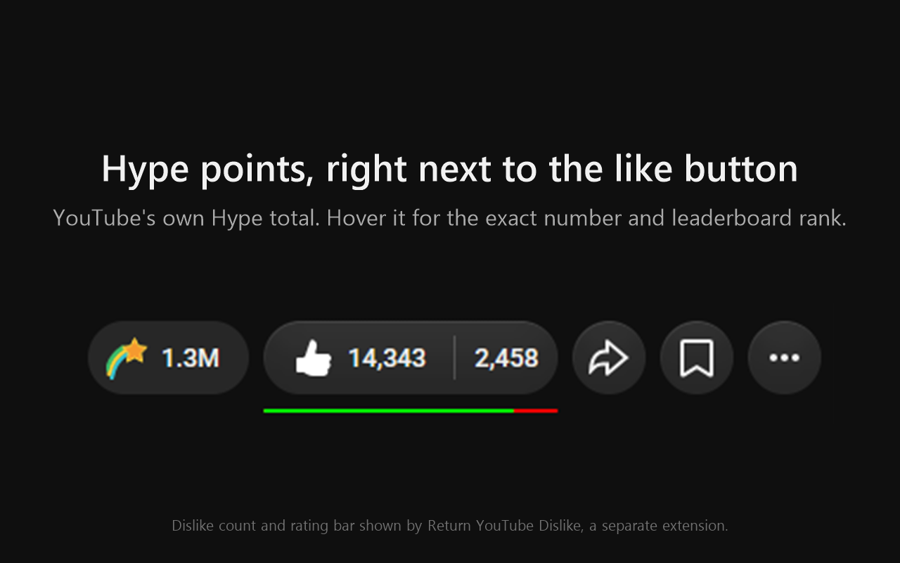
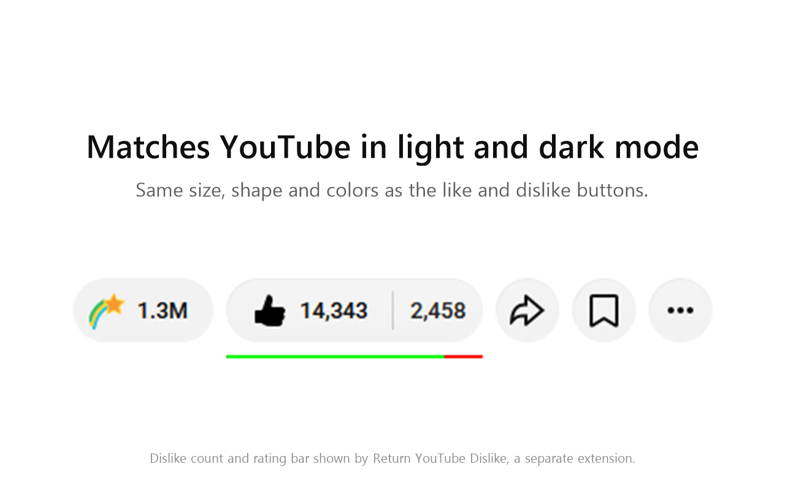

# Hype Meter for YouTube

A Firefox extension that shows how many **Hype points** a YouTube video has, in a small pill next to the like and dislike buttons, styled like YouTube's own buttons.

*The dislike count and rating bar in these screenshots come from [Return YouTube Dislike](https://addons.mozilla.org/firefox/addon/return-youtube-dislikes/), a separate extension.*

YouTube's Hype feature is mobile-only. On desktop you can see a video's leaderboard rank ("#14 hyped") but not its points. This fills that in:

- **Hype points**, e.g. **1.3M**
- **Hover** for the exact number and rank, e.g. "1,359,350 Hype points · #14 on the Hype leaderboard"
- **Nothing at all** on videos YouTube doesn't report Hype points for (for example, videos from channels with more than 500K subscribers)
- **Matches YouTube** in size and color, in both light and dark mode

The number is YouTube's own Hype point total (the same value the mobile app shows), not an estimate.

## How it works

YouTube's official API has no Hype data, and the desktop site only gets a video's rank. YouTube's mobile website does get the points, so when you open a video, the extension asks YouTube for that video the way the mobile website does (a ~25 KB request) and reads the Hype points from the answer. Results are kept in memory for 5 minutes per video.

- **Clicking a video** starts the lookup immediately, so the number is usually ready before YouTube draws the video's buttons.
- **Loading a page directly** waits until the page's initial load is done, so it never competes with YouTube's own first requests.
- The pill appears together with YouTube's like/dislike row. That row can take a few seconds, especially with an ad blocker ([YouTube deliberately slows pages for ad-block users](https://www.androidauthority.com/youtube-blames-ad-blockers-slow-load-times-3387523/)), and the pill can't appear before the row it sits in.

## Safety

- **One request, to YouTube only.** It sends the ID of the video you're watching to `www.youtube.com`, and nowhere else. Because that ID leaves your browser, the extension declares **"browsing activity"** in Firefox's data consent, which Firefox shows when you install it.
- **Anonymous.** The request is sent without your cookies, so it's never tied to your account.
- **No permissions requested.** Nothing is sent to the developer or any other server, and nothing is saved to disk (results only live in memory for 5 minutes).
- **Nothing from the response runs as code.** The pill is built with plain text, never HTML from YouTube.

## Compatibility

- **Firefox 142 or newer**, on desktop. Firefox for Android and the mobile YouTube site aren't supported.
- **Works alongside Return YouTube Dislike.** The pill sits outside the like/dislike button group, so it doesn't interfere with RYD's counts or rating bar.

## Limits

- This uses YouTube's internal (unofficial) API. YouTube can change or block it at any time, and the extension will simply stop showing the pill until it's updated.
- Firefox only (it relies on Firefox's `content.fetch`).
- The tooltip wording is in English.

## Install

**Firefox Add-ons:** coming soon. It's currently in Mozilla's review, and the install link will be added here once it's approved. Installing from Firefox Add-ons keeps it installed and updates it automatically.

**Try it now (stays until Firefox restarts):**

1. Download this repo (**Code → Download ZIP**) and unzip it.
2. In Firefox, go to `about:debugging#/runtime/this-firefox`.
3. Click **Load Temporary Add-on…** and choose the `manifest.json` file from the unzipped folder.

## Problems or ideas

Open an issue: https://github.com/ZIGAG1999/youtube-hype-meter/issues

## License

[MIT](LICENSE)
